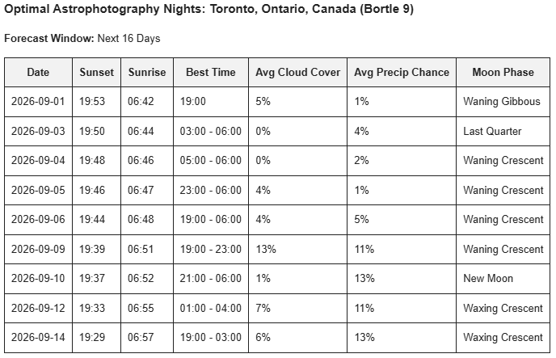

# Astro-Night-Checker: 16-Day Astrophotography Forecasting Engine

astro-night-checker is a Python and SQL data pipeline designed to streamline the planning phase of deep-sky astrophotography. Capturing targets like the Andromeda Galaxy (M31) requires a strict intersection of variables: long, uninterrupted dark-sky windows, minimal lunar interference, and low cloud cover to ensure clean sub-exposures for stacking in image processing tools.

Rather than manually cross-referencing planetarium software and meteorological models across multiple platforms, this pipeline evaluates every hour between sunset and sunrise over a 16-day forecast for any target location globally. It identifies the longest continuous blocks of shootable skies, computes exact lunar ephemeris natively, logs forecast runs into a local SQLite database, and dispatches a structured HTML schedule directly to your email on demand.

## Core Features
*   **Dynamic Global Targeting:** Geocodes any city and country input to pull exact local coordinates and evaluate location-specific weather arrays.
*   **Continuous Window Optimization:** Ranks atmospheric data across each night to find the longest uninterrupted blocks of clear skies between sunset and sunrise to maximize total integration time.
*   **Native Ephemeris Engine:** Calculates the true ecliptic longitudinal separation between the Sun and Moon to append precise lunar phase classifications directly to each optimal shooting window.
*   **Formatted Email Dispatch:** Compiles optimal shooting dates, sun event times, window durations, average cloud cover, and precipitation chances into a responsive HTML table sent directly to your inbox upon script execution.
<p align="center">
  
</p>

## Data Sources & APIs
*   **[Open-Meteo Geocoding API](https://open-meteo.com/en/docs/geocoding-api):** Keyless endpoint used to resolve global string inputs (City, Country) into precise latitude, longitude, and elevation coordinates.
*   **[Open-Meteo Weather API](https://open-meteo.com/en/docs):** Supplies 16-day hourly arrays for cloud cover and precipitation probability, alongside daily sunset and sunrise timestamps adjusted automatically to local time zones.
*   **[Astropy](https://www.astropy.org/):** Powers the offline astronomical mathematical engine for planetary coordinates, time handling, and reference frame transformations.
*   **[Light Pollution Map](https://lightpollutionmap.app/):** Referenced manually to construct the script's static Bortle scale dictionary for localized sky quality estimation.

## Installation & Setup

1.  **Clone the repository:**
    ```bash
    git clone [https://github.com/lazelee/astro-night-checker.git](https://github.com/lazelee/astro-night-checker.git)
    cd astro-night-checker
    ```

2.  **Install dependencies:**
    ```bash
    pip install requests pandas astropy python-dotenv
    ```

3.  **Configure Environment Variables:**
    Create a `.env` file in the root directory and add your email credentials:
    ```env
    SENDER_EMAIL=your_email@gmail.com
    APP_PASSWORD=your_16_digit_app_password
    ```

4.  **Run the Pipeline:**
    ```bash
    python pipeline.py
    ```
